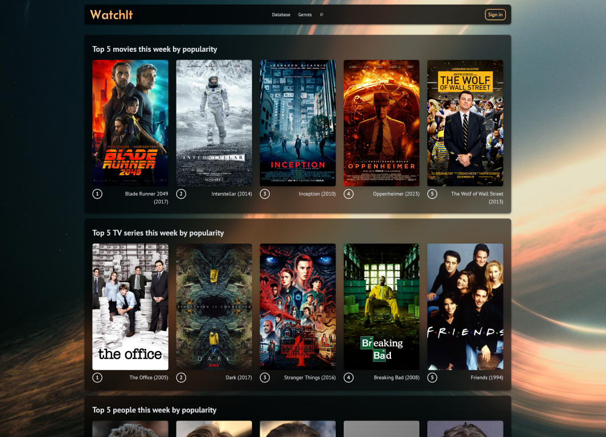

<h1 align="center">WatchIt</h1>

<h3 align="center"><b>Movie and tv series database along with social media platform for cinematography fans.</b></h3>

WatchIt is web application entirely created using .NET technologies (not counting HTML and CSS). Backend was written using ASP.NET Web API framework, while the frontend is using Blazor Server. The application uses PostgreSQL as a database and EF Core to communicate with it. This project was topic of my engineer degree thesis at Warsaw University of Technology.

---

## Informations

> [!IMPORTANT]
> **For Github users:**
>
> This is only mirror repository. All changes are first uploaded to the repository <a href="https://repos.mateuszskoczek.com/MateuszSkoczek/WatchIt">here</a>. However, Github repository handles issues and pull requests for better accessibility.

> [!WARNING]  
> App is no longer maintained. Some features might not work properly. I leave the repository mainly as a sample of my work.

## Features

- Browse lists of films, series, and people, as well as perform basic filtering and sorting of these lists.
- View detailed information about productions and people.
- Register an account and log in.
- Rate a given production or role, provided you have an account on the website.
- Basic personalization of your profile.
- Follow other users and view their profiles.
- Ability to add, delete, and edit information in the database from the website, provided you have administrator privileges.

## Usage

**Requirements:**

- .NET SDK 9.0
- PostgreSQL server with *track_commit_timestamp* option turned on
- C# IDE, e.g. JetBrains Rider or Visual Studio (optional, but recommended)
- pgAdmin (optional, but recommended)

To be able to start application you have to change some settings in appsettings.json file both in WatchIt.WebAPI and WatchIt.Website projects. In WatchIt.WebAPI you have to set connection string (*ConnectionStrings.Database*) to point to your database server. In WatchIt.Website you have to change base address (*Clients.BaseAddress*) to API (i.e. to the API launched from the WatchIt.WebAPI project). For testing purposes it will probably be "http://localhost:5128".

You should now be able to run both projects and use the website. You can create new account. This account will not have the administrator privileges, needed to add movies and other data, by default. To add administrator privileges you have to edit account record in "Account" table in database (you can do it for example with pgAdmin software).

## Attribution

This project is open source on MIT License, so you can just copy and upload again to your repository. But according to the license, you must include information about the original author. You can find license <a href="https://repos.mateuszskoczek.com/MateuszSkoczek/VDownload/src/branch/main/LICENSE">here</a>.

**Other sources:**

- Icons by <a href="icons8.com">Icons8</a>